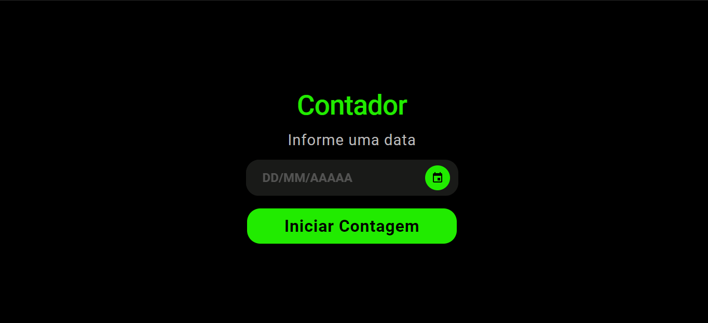
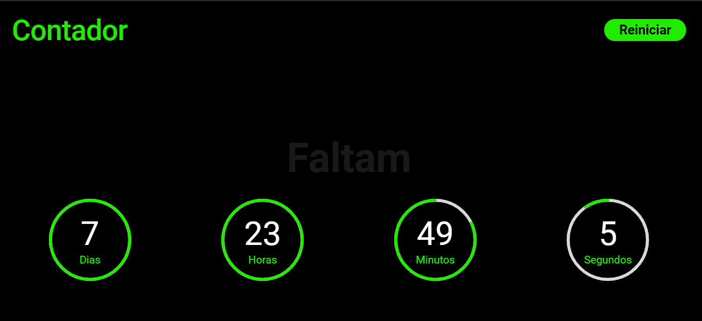

# Challenge Countdown

Este projeto foi desenvolvido com base no desafio Contador do [DevChallenge](https://www.devchallenge.com.br/c)

## Tecnologia Utilizada
[ReactJS](https://reactjs.org/)

## Telas do Projeto

    
    

## Funcionalidade
Aplicação para contar quantos dias faltam para chegar a uma determinada data escolhida pelo usuário.

### Como instalar?
* Clone este repositório, entre na pasta do projeto e digite o comando ``yarn install`` ou apenas ``yarn`` no seu terminal. 

* Ao finalizar, digite ``yarn start`` e acesse [http://localhost:3000](http://localhost:3000) para visualizar a aplicação funcionando no seu navegador.

Feito com carinho por [Anna Grazielle](https://github.com/grazielleanna) 🚀